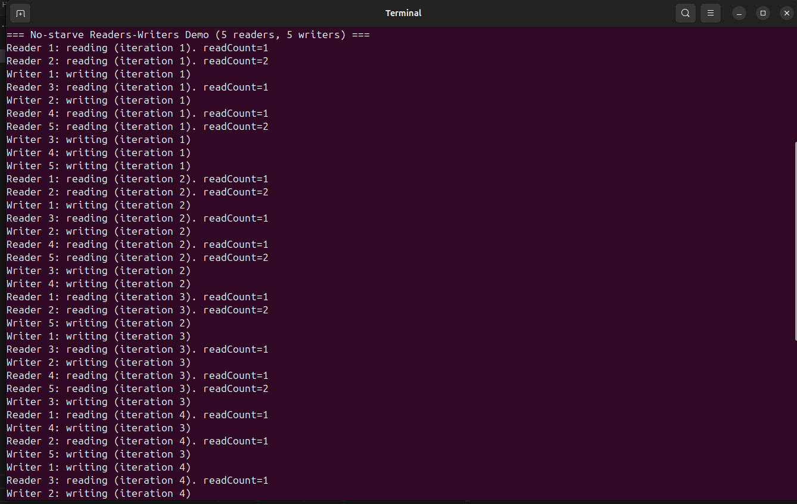
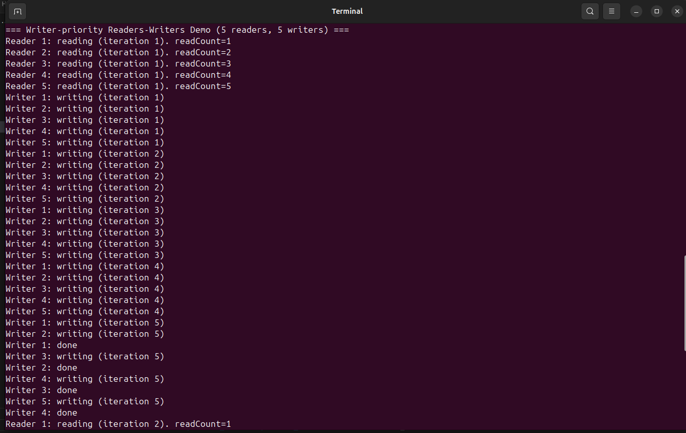
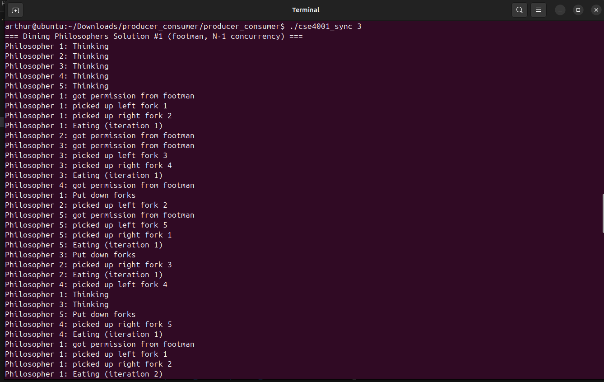
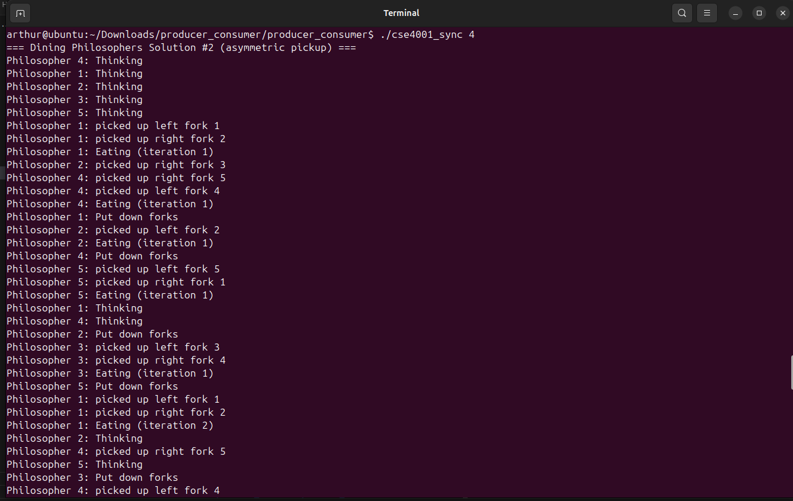

CSE 4001 – Synchronization Assignment
====================================

#### Name: Arthur Quarra 
#### Course: CSE 4001 Operating Systems
#### Assignment: Multi-thread Synchronization using Semaphores
#### Program Name: cse4001_sync
--------------------------------------------
# 1. Project Description

This project implements four classic synchronization problems using semaphores:

1. No-starve Readers–Writers Solution  
2. Writer-priority Readers–Writers Solution  
3. Dining Philosophers Solution #1 (Footman or N–1 solution)  
4. Dining Philosophers Solution #2 (Asymmetric solution)

The solutions are based on algorithms from:
"The Little Book of Semaphores" by Allen B. Downey.

The project uses POSIX threads (pthread) and custom semaphore wrapper code.

--------------------------------------------
# 2. How to Compile

Run the included Makefile:

    make

This produces the executable:

    cse4001_sync

To clean:

    make clean

--------------------------------------------
# 3. How to Run

Run the program with:

    ./cse4001_sync <problem_number>

Example:

    ./cse4001_sync 2

The available problem numbers:  
1 → No-starve Readers–Writers  
2 → Writer-priority Readers–Writers  
3 → Dining Philosophers #1  
4 → Dining Philosophers #2  

--------------------------------------------
# 4. Program Outputs (Screenshots)

Include your screenshots in the locations shown below.

Problem 1 — No-starve Readers/Writers Output
--------------------------------------------

Problem 2 — Writer-priority Readers/Writers Output
--------------------------------------------------

Problem 3 — Dining Philosophers #1 Output
-----------------------------------------

Problem 4 — Dining Philosophers #2 Output
-----------------------------------------

--------------------------------------------
# 5. Files Included

- cse4001_sync.cpp
- semaphore_class.h
- Makefile
- README.txt

--------------------------------------------
# 6. Notes

- All solutions avoid deadlock.
- Each output includes thread activity messages such as:
      "Reader X: reading"
      "Writer X: writing"
      "Philosopher X: eating"
      "Philosopher X: thinking"
- Semaphores control access to shared resources (critical sections).
- The program runs indefinitely to demonstrate live synchronization behavior.

--------------------------------------------
# 7. References

Allen Downey, "The Little Book of Semaphores"  
Green Tea Press  
http://greenteapress.com/wp/semaphores/

